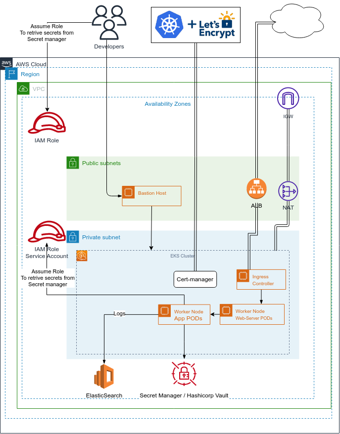

# Design task

## Symantec’s solution depends on multiple services such as

- ### AWS
- ### ElasticSearch
- ### “Let’s Encrypt”

## Due to obvious reasons, access to the above-mentioned services, by Symantec’s internal services, requires authentication.

# Goal

1. Suggest a design for storing and accessing secrets securely by internal services or authorized developers
2. Define all components involved and how they would interact with one another
3. Present the considered alternatives and explain the strengths/weaknesses of the selected solution

# Solution

We can use `Hashicorp Vault` or AWS `Secret Manager` in order to Store secrets.

We can use AWS IAM Roles in order to access to the secrets.

We can use `Hashicorp Vault` API in order to retrieve secrets.

Interactions:

- In `Hashicorp Vault` we have secrets stored encrypted and protected by authentication mechanisms.
- Using AWS IAM, Internal services and authorized developers authenticate before accessing secrets through the secret management tool API.

- By using the API secrets are retrieved from the secret management tool and returns them to the requester.

- Let's Encrypt is used as a CA to secure the communication between the API and the requester using SSL/TLS certificates.
- Elasticsearch is used to store logs of secret access, used for auditing and monitoring.

Authentication:
Use of AWS IAM roles in order to authenticate internal services or authorized developers before allowing access to secrets.
The authentication can be based on:

- Usernames and passwords
- API keys
- Certificates

Alternatives solutions:

1. Use of `Environment Variables`
   - Simple and easy to implement `BUT` not secure because it can be easily accessed by unauthorized entities `AND` not easily rotated or revoke.
2. Use of `Configuration files`
   - The configuration files can be encrypted and decrypted at runtime, `BUT` yet again the encryption key must be stored securely which can be difficult to manage

# Strengths of the selected solution

By using `Vault` or `Secret manager` we have

- Centralized and secure storage for secrets with access control to secrets through policies and authentication mechanisms(AWS IAM)
- Easy to use API for accessing secrets
- Scalable and secure solution for managing secrets
- Ability to rotate and revoke secrets

# Weaknesses of the selected solution

- Additional infrastructure
- Need for maintenance
- More complex to set up and configure compared to other solutions
- Reliability of the secret management tool
